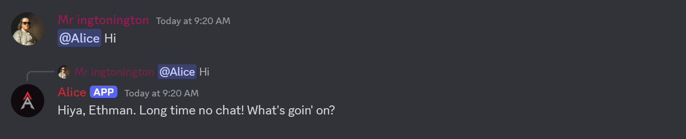

    <h1>Alice Discord AI Bot</h1>
    <h3 align="center">Discord bot to interact with <a href="https://github.com/jmorganca/ollama">Ollama</a> and <a href="https://github.com/lllyasviel/stable-diffusion-webui-forge">Stable Diffusion WebUI Forge</a> as a chatbot</h3>
    <h3></h3>
    <h2>This bot was made for my needs, It is not made for other's in mind I would recommend going to the repo I forked this from for a better time!</h2>
    <a href="https://ethmangameon.github.io/alice-app/home.html">My website for my bot (Alice) that runs this code!</a>

